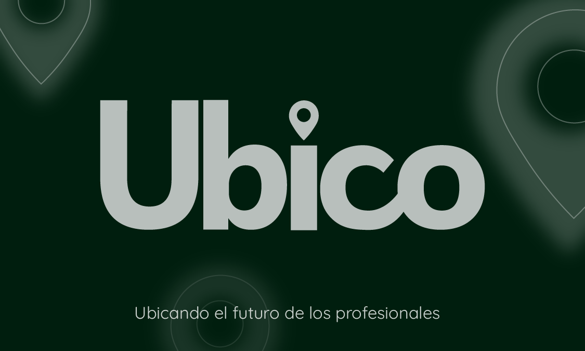

# Documentation Ubico
___
## Founders:
* Andrés Felipe Pinzón Franco
* Jose Alejandro Tobón Pérez
* Yenny Marcela Vargas Rincón

### Table of Contents
___
<!-- Tabla de contenido-->

| # | Index |
|---|-------|
| 1 |[Vision](Vision.md)|
| 2 |[Domain Model](Domain_Model.md)|
| 3 |[Event Storming](Event_Storming.md)
| 4 |[Requirements](Requirements.md)
| 5 |[Reference Architecture](Reference_Architecture-md.md)
| 6 |[Class Diagram](Class_Diagram.md)
| 7 |[MER](MER.md)
| 8 |[No SQL Data Model](No_SQL_Data_Model.md)
| 9 |[Components Model](Components_Model.md)
| 10 |[Model Packages](Packages_Model.md)
| 11|[Activity Diagram](Activity_Diagram.md)
| 12|[Sequences Diagram](Sequences_Diagram.md)
| 13|[State Diagram](State_Diagram.md)
| 14|[Deployment Diagram](Deployment_Diagram.md)
